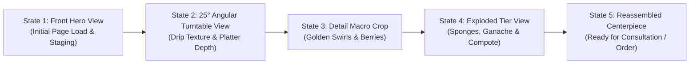

# Architecture Blueprint: Future Scroll-Driven Product Sequence (Apple-Style)

## Executive Summary
This document establishes the architectural roadmap for a future Apple-style scroll-driven product sequence for KidOld Bakers. 

The core philosophy is:
> **Scroll position drives deterministic, meaningful product view states — never arbitrary floating or continuous wobbling.**

---

## 1. Product View States Progression

When fully implemented, scrolling through the hero / showcase section will advance the celebration cake through discrete, story-driven states:



### State Progression Details
1. **State 1: Front Hero View (0% Scroll)**
   - Symmetric, majestic centerpiece on artisan pedestal.
   - Clean presentation showing full 2-tier celebration cake.
2. **State 2: 25° Angular Turntable View (25% Scroll)**
   - Controlled axial rotation revealing 3D depth of dark chocolate ganache drips and gold leaf accents.
3. **State 3: Detail Macro Focus (50% Scroll)**
   - Camera zooms subtly into the handcrafted textures: fresh raspberries, wild blueberries, and buttercream swirls.
4. **State 4: Exploded Layer / Anatomical View (75% Scroll)**
   - Top tier, chocolate drip crown, Belgian cocoa sponge, and berry compote layers separate vertically with callouts (e.g. *Dutch Cocoa Sponge*, *Vanilla Chiffon*, *100% Pure Veg Dairy Cream*).
5. **State 5: Reassembled Masterpiece (100% Scroll)**
   - Layers smoothly snap back into the completed bespoke cake, transitioning directly into the *Design My Cake* customizer.

---

## 2. Technical Implementation Approaches

There are two production-grade pathways for implementing this architecture when approved:

### Option A: Pre-rendered Canvas Frame Sequence (Maximum Reliability & Performance)
- **Mechanism**: A sequence of 60–90 ultra-high-resolution WebP frames exported from a 3D studio render (Blender or Cinema 4D).
- **Rendering**: Drawn directly to an HTML5 `<canvas>` element via `requestAnimationFrame` indexed by `ScrollTrigger.progress`.
- **Advantages**:
  - 100% photorealistic studio lighting, subsurface scattering on frosting, and real fruit reflections.
  - Zero GPU shaders or 3D engine overhead on low-end mobile devices.
  - Zero Three.js / WebGL bundle size penalty (~0 KB additional runtime dependencies).
  - Deterministic frame caching and preloading.

### Option B: Interactive Real-Time 3D Mesh (Three.js / React Three Fiber)
- **Mechanism**: A glTF/GLB model loaded inside the pre-architected `custom3DCanvas` slot in [`HeroProductStage.tsx`](file:///g:/Coding/Projects/Antigravity/KidOld-Bakers/src/components/sections/hero/HeroProductStage.tsx).
- **Rendering**: Three.js perspective camera dolly and mesh tier translations animated via GSAP ScrollTrigger timeline.
- **Advantages**:
  - Full real-time interactivity: user can pause scroll and orbit with touch/pointer.
  - Dynamic material swapping: user selections in *Design My Cake* (flavor, color, tiers) reflect live in the 3D model.

---

## 3. Modular Drop-in Integration Contract

The current component architecture is already prepared for this transition:

```tsx
// Inside HeroProductStage.tsx:
<div className="hero-stage-visual relative">
  {custom3DCanvas ? (
    // Future Apple-style Canvas / 3D Engine Slot
    <div className="relative w-full aspect-[4/3.5] rounded-[2.75rem] overflow-hidden">
      {custom3DCanvas}
    </div>
  ) : (
    // Current Stable High-Res Editorial Photography
    <Image src={heroMediaConfig.authenticPhotoSrc} ... />
  )}
</div>
```

Zero changes to page layout, navbar, headings, or surrounding typography will be required when this feature is introduced.
